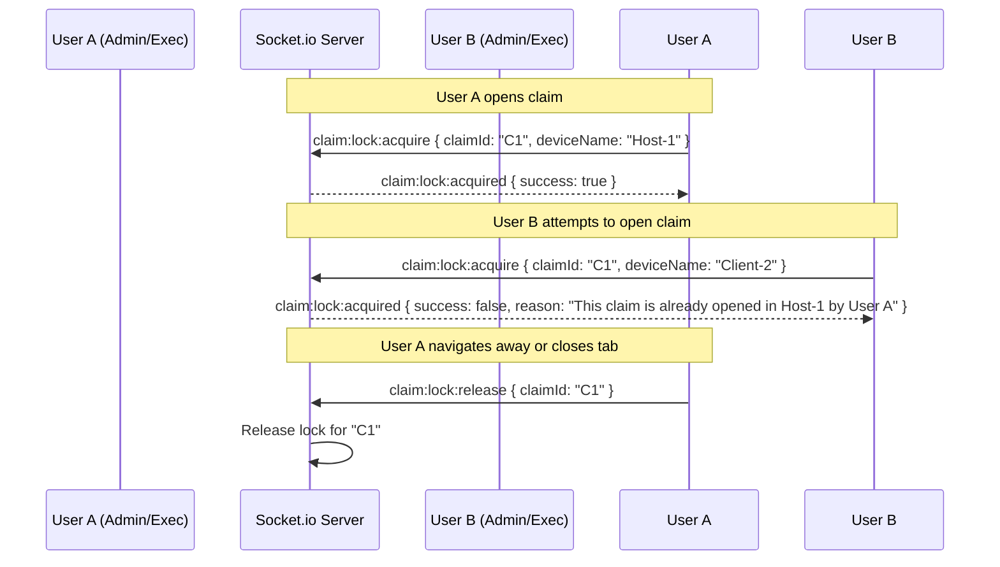

# Claim Concurrency Locking System

This document outlines the architecture and step-by-step implementation plan for preventing concurrent editing of claims in the Malavia-claim application.

---

## 1. Core Architecture

The concurrency locking mechanism uses the existing **Socket.io** server to manage real-time editing locks.



### In-Memory Lock Registry

Since WebSocket connections are stateful, we can store active locks in-memory on the backend server. If the server scales horizontally in the future, this can be transitioned to Redis or MongoDB.
Each lock entry will contain:

- `claimId` (String) - The unique ID of the claim.
- `userId` (String) - ID of the user currently editing.
- `username` (String) - The username of the user editing.
- `fullName` (String) - The full name of the user editing.
- `deviceName` (String) - The client device name.
- `socketId` (String) - The socket connection ID (crucial for auto-releasing locks on disconnect).
- `acquiredAt` (Date) - Timestamp of lock acquisition.

---

## 2. Backend Implementation Strategy (`apps/backend`)

### A. Create a Lock Manager Service

Create a utility service to encapsulate in-memory lock CRUD operations:

- `acquireLock(claimId, user, deviceName, socketId)`: Returns the lock if acquired, or the owner information if already locked.
- `releaseLockByClaim(claimId, socketId)`: Releases the lock.
- `releaseLocksBySocket(socketId)`: Releases all locks associated with a disconnected socket (prevents stale locks if a browser tab crashes).

### B. Register Socket.io Handlers (`apps/backend/src/config/socket.ts`)

Listen to locking events inside the connection listener:

1. **`claim:lock:acquire`**:
   - Check user role. If `role === 'PHARMACIST'`, acknowledge immediately with success (pharmacists are excluded).
   - Attempt to acquire the lock using the Lock Manager.
   - If successful, return `{ success: true }`.
   - If failed, return `{ success: false, message: "This claim is already opened in <DEVICE_NAME> by <LOGGED_IN_USERNAME>." }`.
2. **`claim:lock:release`**:
   - Remove the lock associated with the given `claimId` and `socket.id`.
3. **`disconnect`**:
   - Catch socket disconnects and call `releaseLocksBySocket(socket.id)` to clean up all locks held by the disconnected user.

---

## 3. Frontend Implementation Strategy (`apps/frontend`)

### A. Resolve Device Name

To identify the client device:

1. **Electron Host/Clients**: If running in Electron, expose `os.hostname()` through an IPC bridge/preload script.
2. **Web Fallback**: If running in a web browser, generate a friendly display name using browser info or user-agent details (e.g. `Chrome on Windows 11`) and store it in `localStorage` to keep it persistent for that client.

```typescript
// Example device name resolution
export function getDeviceName(): string {
  // If Electron API is injected in window
  if ((window as any).electronAPI?.getHostname) {
    return (window as any).electronAPI.getHostname();
  }

  // Web fallback
  let deviceName = localStorage.getItem("device_name");
  if (!deviceName) {
    const userAgent = navigator.userAgent;
    const isWindows = userAgent.includes("Windows");
    const isMac = userAgent.includes("Macintosh");
    const os = isMac ? "macOS" : isWindows ? "Windows" : "Linux";

    // Create random identifier
    const rand = Math.floor(100 + Math.random() * 900);
    deviceName = `Browser (${os}-${rand})`;
    localStorage.setItem("device_name", deviceName);
  }
  return deviceName;
}
```

### B. Integrate in Claim Details (`ClaimDetailsPage.tsx`)

Add lock state tracking to the claim detailed view:

1. Check if the logged-in user is a `PHARMACIST`. If so, skip WebSocket locking entirely.
2. For all other roles, on component mount or when `claimId` changes:
   - Resolve `deviceName`.
   - Connect and emit `claim:lock:acquire` via Socket.io.
   - Await the response. If the backend returns `success: false`:
     - Block the page interactions.
     - Render an immersive overlay or show a clean banner stating: **"This claim is already opened in [Device] by [User]."**
     - Disable all save, edit, and transition action buttons to prevent mutations.
   - On component cleanup (unmount or navigation):
     - Emit `claim:lock:release` for the current `claimId`.

---

## 4. Edge Cases & Resilience

> [!WARNING]
> **Orphaned Locks**: If a user closes the browser window, terminates Electron, or suffers a network drop, the backend's Socket.io `disconnect` event will fire and immediately clean up all locks held by that `socketId`. This guarantees that claims do not remain permanently locked.

> [!IMPORTANT]
> **Page Reloads**: A page reload will naturally disconnect the socket and reconnect a new one, briefly releasing and re-acquiring the lock. Since the operations are extremely fast, this will feel seamless to the user.

> [!NOTE]
> **Tab Concurrency**: If the same user opens the same claim in two separate browser tabs, they will have two different sockets. The second tab will show the lock error since it holds a different `socketId`. This is expected and prevents users from conflicting with their own edits.
