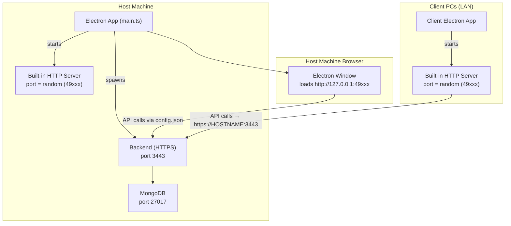
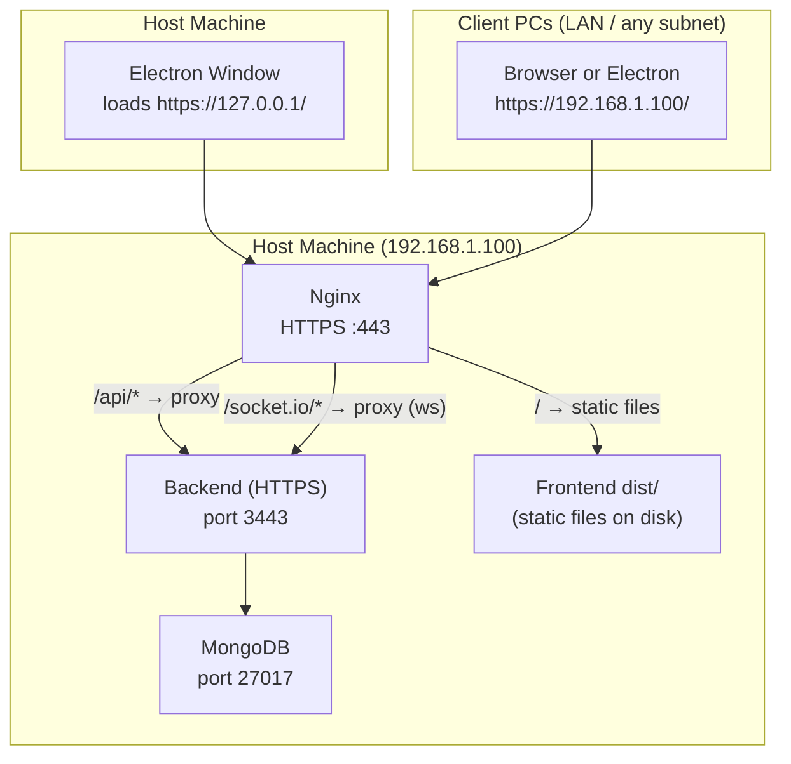

# Current Architecture vs Nginx Configuration

## Current Setup (No Nginx)

You're correct -**Nginx is NOT involved in the current setup at all**. The existing `nginx.conf` in the repo root is a stale/unused file (it references port 80, `localhost:5000`, and `D:/Claims/` -none of which match your actual setup).

Here's how it actually works today:

### Architecture Diagram (Current)



### How It Works Step-by-Step

| Component              | What happens                                                                                                                                                                                                        | Port                          |
| ---------------------- | ------------------------------------------------------------------------------------------------------------------------------------------------------------------------------------------------------------------- | ----------------------------- |
| **Backend**            | Electron spawns `server.bundle.cjs` as a detached HTTPS process. Uses self-signed SSL certs from `apps/backend/cert/`.                                                                                              | **3443** (fixed, HTTPS)       |
| **Frontend Server**    | Electron creates a **plain HTTP** static file server via `http.createServer()` with `server.listen(0, "0.0.0.0")` -port `0` means the OS picks a **random available port** (hence `49xxx`).                         | **Random** (e.g. 49152–65535) |
| **Electron Window**    | Loads `http://127.0.0.1:{randomPort}` to display the React SPA.                                                                                                                                                     | -                             |
| **Frontend → Backend** | A `config.json` is written to the frontend's `dist/` folder with `apiBaseUrl: https://HOSTNAME:3443/api/v1` and `socketUrl: https://HOSTNAME:3443`. The React app fetches this at startup to know where the API is. | -                             |
| **Client PCs**         | Run the Electron app from a network share (UNC path). They detect they're clients, skip backend startup, and point `config.json` to the host's hostname + port 3443.                                                | -                             |

### Key Points About the Current Setup

1. **No Nginx** -The old `nginx.conf` at repo root is not used
2. **Frontend port is random** -Different on every launch, different on every client machine
3. **Backend is always HTTPS on 3443** -Self-signed certificate
4. **Direct connection** -Clients connect directly to `https://HOSTNAME:3443` for API/Socket.io
5. **Firewall rule** -Electron auto-creates a Windows Firewall rule for port 3443

### Why Hostname-Based Access Has Limits

The current setup uses the host machine's **Windows hostname** (e.g. `https://MALAVIA-HOST:3443`) for client connections. This works fine on a pure LAN where DNS/NetBIOS can resolve hostnames, but breaks in several real-world scenarios:

- Clients on a different subnet or VLAN where NetBIOS name resolution doesn't reach
- Any future remote/WAN access (e.g. VPN, branch office)
- Environments with custom DNS configurations that don't propagate the host's name
- Inconsistent hostname resolution across different Windows network profiles

Using a **static IP** for the host machine eliminates all of these issues -clients always connect to a known, fixed address regardless of DNS or hostname resolution.

---

## Why Add Nginx?

| Benefit                     | Description                                                                                             |
| --------------------------- | ------------------------------------------------------------------------------------------------------- |
| **Single stable port**      | All traffic (frontend + API + WebSocket) goes through one known port (e.g. 443 or 8443)                 |
| **Proper SSL termination**  | Nginx handles SSL with a real or better-managed certificate. Backend can run plain HTTP                 |
| **No random ports**         | Browser clients can access the app directly via `https://HOST_IP/` without needing the Electron wrapper |
| **WebSocket proxying**      | Nginx handles WebSocket upgrade for Socket.io properly                                                  |
| **Static IP compatibility** | `config.json` points to a fixed IP -no hostname resolution required                                     |
| **Future scalability**      | Can add caching, rate limiting, load balancing later                                                    |

---

## Static IP Setup for Host Machine

This is the recommended approach to make client connections reliable and DNS-independent.

### Step 1 -Assign a Static IP on the Host Machine

1. Open **Control Panel → Network and Sharing Center → Change adapter settings**
2. Right-click the active network adapter → **Properties**
3. Select **Internet Protocol Version 4 (TCP/IPv4)** → **Properties**
4. Choose **Use the following IP address** and fill in:

   | Field               | Example Value   | Notes                                                 |
   | ------------------- | --------------- | ----------------------------------------------------- |
   | **IP address**      | `192.168.1.100` | Pick a fixed address outside your router's DHCP range |
   | **Subnet mask**     | `255.255.255.0` | Match your LAN subnet                                 |
   | **Default gateway** | `192.168.1.1`   | Your router's IP                                      |
   | **Preferred DNS**   | `192.168.1.1`   | Can be same as gateway                                |

> [!TIP]
> To find your current LAN details, run `ipconfig` in PowerShell. Look at the active adapter's IPv4 Address, Subnet Mask, and Default Gateway.

> [!IMPORTANT]
> Also log into your **router's admin panel** and add a **DHCP reservation** (also called "static DHCP" or "address binding") for the host machine's MAC address. This prevents the router from assigning that IP to another device even on DHCP leases.

### Step 2 -Verify the Static IP

```powershell
# Confirm the IP is assigned
ipconfig

# Test from a client machine
ping 192.168.1.100
```

### Step 3 -Update `config.json` to Use the Static IP

After setting up Nginx, `main.ts` should write the `config.json` using the **static IP** instead of the hostname:

```json
{
  "apiBaseUrl": "https://192.168.1.100/api/v1",
  "socketUrl": "https://192.168.1.100"
}
```

This means clients need zero DNS resolution -they connect directly to the IP.

### Static IP vs Hostname -Comparison

| Aspect                         | Hostname (current)              | Static IP (proposed)   |
| ------------------------------ | ------------------------------- | ---------------------- |
| **LAN-only reliability**       | ✅ Usually works                | ✅ Always works        |
| **Cross-subnet / VLAN**        | ❌ Hostname resolution may fail | ✅ Works               |
| **Future VPN / remote access** | ❌ Hostname may not resolve     | ✅ Works               |
| **DNS dependency**             | ❌ Depends on NetBIOS/DNS       | ✅ None                |
| **Setup effort**               | None (already works)            | One-time IP assignment |

---

## Proposed Nginx Configuration

### Architecture After Nginx + Static IP



### Proposed `nginx.conf`

```nginx
# ── Malavia Claims – Nginx Reverse Proxy ──────────────────────────
# Place this in your nginx/conf/ directory (e.g. C:/nginx/conf/nginx.conf)
# or include it from the main nginx.conf

worker_processes  1;

events {
    worker_connections  1024;
}

http {
    include       mime.types;
    default_type  application/octet-stream;
    sendfile      on;
    keepalive_timeout  65;

    # ── Upstream: Backend API (HTTPS) ────────────────────────────
    upstream backend {
        server 127.0.0.1:3443;
    }

    # ── HTTPS Server ─────────────────────────────────────────────
    server {
        listen       443 ssl;

        # Accept connections on both localhost and the static IP
        server_name  localhost 192.168.1.100;

        # SSL certificates (use the same ones backend uses, or generate new ones)
        ssl_certificate      "D:/project/malavia-claims/apps/backend/cert/cert.pem";
        ssl_certificate_key  "D:/project/malavia-claims/apps/backend/cert/key.pem";

        ssl_protocols       TLSv1.2 TLSv1.3;
        ssl_ciphers         HIGH:!aNULL:!MD5;

        # ── Frontend: Serve static files ─────────────────────────
        location / {
            root "D:/project/malavia-claims/apps/frontend/dist";
            index index.html;
            try_files $uri $uri/ /index.html;
        }

        # ── API: Proxy to backend ────────────────────────────────
        location /api/ {
            proxy_pass         https://backend;
            proxy_ssl_verify   off;   # Self-signed cert on backend

            proxy_http_version 1.1;
            proxy_set_header   Host              $host;
            proxy_set_header   X-Real-IP         $remote_addr;
            proxy_set_header   X-Forwarded-For   $proxy_add_x_forwarded_for;
            proxy_set_header   X-Forwarded-Proto $scheme;

            proxy_connect_timeout  60s;
            proxy_send_timeout     60s;
            proxy_read_timeout     60s;
        }

        # ── Socket.io: WebSocket proxy ───────────────────────────
        location /socket.io/ {
            proxy_pass         https://backend;
            proxy_ssl_verify   off;

            proxy_http_version 1.1;
            proxy_set_header   Upgrade           $http_upgrade;
            proxy_set_header   Connection        "upgrade";
            proxy_set_header   Host              $host;
            proxy_set_header   X-Real-IP         $remote_addr;
            proxy_set_header   X-Forwarded-For   $proxy_add_x_forwarded_for;
            proxy_set_header   X-Forwarded-Proto $scheme;

            proxy_connect_timeout  60s;
            proxy_send_timeout     300s;
            proxy_read_timeout     300s;
        }
    }

    # ── Optional: Redirect HTTP → HTTPS ──────────────────────────
    server {
        listen       80;
        server_name  localhost 192.168.1.100;
        return 301   https://$host$request_uri;
    }
}
```

> [!NOTE]
> Replace `192.168.1.100` with your actual static IP throughout. The `server_name` line lists both `localhost` (for the host machine itself) and the static IP (for LAN clients) so Nginx accepts requests on both.

---

## SSL Certificate Consideration

The self-signed certificate currently used by the backend was likely generated with `localhost` or the hostname as the CN/SAN. After switching to static IP access, browsers may show a warning because the IP doesn't match the cert's CN.

**Options:**

| Option                              | Effort | Notes                                                                                                   |
| ----------------------------------- | ------ | ------------------------------------------------------------------------------------------------------- |
| **Regenerate cert with IP SAN**     | Low    | Add `subjectAltName = IP:192.168.1.100` when generating. Clients still need to trust the cert manually. |
| **Add cert to client trust stores** | Medium | Push the self-signed cert to client machines via Group Policy or manually. Eliminates browser warnings. |
| **Use a proper CA cert**            | High   | Only viable if you have an internal CA or a public domain pointing to the IP.                           |

### Regenerating the cert with IP SAN (recommended quick fix)

Run this on the host machine to regenerate the cert so it's valid for both `localhost` and the static IP:

```powershell
# In apps/backend/cert/
openssl req -x509 -newkey rsa:4096 -keyout key.pem -out cert.pem -days 3650 -nodes `
  -subj "/CN=malavia-claims" `
  -addext "subjectAltName=IP:192.168.1.100,IP:127.0.0.1,DNS:localhost"
```

---

## What Changes in the App After Nginx + Static IP

### Frontend `config.json` Changes

Currently Electron writes:

```json
{
  "apiBaseUrl": "https://HOSTNAME:3443/api/v1",
  "socketUrl": "https://HOSTNAME:3443"
}
```

**After Nginx + Static IP**, it should write:

```json
{
  "apiBaseUrl": "https://192.168.1.100/api/v1",
  "socketUrl": "https://192.168.1.100"
}
```

No more `:3443`, no more hostname -everything goes through Nginx on port 443 at the fixed IP.

### Summary of Required Code Changes

| File                                                                                 | Change                                                                             |
| ------------------------------------------------------------------------------------ | ---------------------------------------------------------------------------------- |
| [main.ts](file:///d:/project/malavia-claims/apps/desktop/src/main.ts#L240-L242)      | Change `writeRuntimeConfig()` to use static IP + port 443 instead of HOSTNAME:3443 |
| [main.ts](file:///d:/project/malavia-claims/apps/desktop/src/main.ts#L616)           | Add firewall rule for port 443 (in addition to or replacing 3443)                  |
| [main.ts](file:///d:/project/malavia-claims/apps/desktop/src/main.ts#L901)           | `waitForHostBackend` should check port 443                                         |
| [vite.config.ts](file:///d:/project/malavia-claims/apps/frontend/vite.config.ts#L39) | Dev proxy target stays at `localhost:3443` (dev mode bypasses Nginx)               |
| [nginx.conf](file:///d:/project/malavia-claims/nginx.conf)                           | Replace the stale config with the one above                                        |
| **Backend**                                                                          | No changes needed -backend keeps running on 3443, Nginx proxies to it              |
| **SSL cert**                                                                         | Regenerate with IP SAN (`192.168.1.100`) to avoid browser warnings                 |

### Before vs After Comparison

| Aspect                    | Before (Current)                     | After (Nginx + Static IP)                        |
| ------------------------- | ------------------------------------ | ------------------------------------------------ |
| **Frontend port**         | Random (`49xxx`, HTTP)               | **443** (HTTPS, via Nginx)                       |
| **Backend port**          | 3443 (HTTPS, direct)                 | 3443 (HTTPS, behind Nginx)                       |
| **Client access URL**     | `https://HOSTNAME:3443` for API only | `https://192.168.1.100/` for everything          |
| **DNS dependency**        | ❌ Requires hostname resolution      | ✅ None -direct IP                               |
| **Cross-subnet access**   | ❌ May fail                          | ✅ Works                                         |
| **Browser access**        | Not possible without Electron        | ✅ `https://192.168.1.100/` works in any browser |
| **SSL**                   | Self-signed on backend only          | Nginx terminates SSL for all traffic             |
| **WebSocket**             | Direct to `HOSTNAME:3443`            | Proxied through Nginx `/socket.io/`              |
| **Firewall ports needed** | 3443 + random frontend port          | 443 only (3443 stays localhost-only)             |

---

## Installation Steps (Windows)

1. **Assign a static IP** to the host machine (see Static IP Setup section above)
2. **Download Nginx for Windows** from [nginx.org](http://nginx.org/en/download.html)
3. Extract to e.g. `C:\nginx\`
4. Replace `C:\nginx\conf\nginx.conf` with the config above
5. Update `192.168.1.100` everywhere in the config to your actual static IP
6. Regenerate the SSL cert with the IP SAN (see SSL section above)
7. Start Nginx: `cd C:\nginx && start nginx`
8. Verify: Open `https://192.168.1.100/` in a browser from a client PC

### Nginx Commands (Windows)

```powershell
# Start
cd C:\nginx; .\nginx.exe

# Reload config (after editing nginx.conf)
cd C:\nginx; .\nginx.exe -s reload

# Stop
cd C:\nginx; .\nginx.exe -s stop

# Test config
cd C:\nginx; .\nginx.exe -t
```

> [!IMPORTANT]
> After setting up Nginx, update `main.ts` to remove the built-in HTTP server and write `config.json` pointing to the static IP on port 443 instead of HOSTNAME:3443. Also ensure port 3443 is **not** exposed in Windows Firewall for external interfaces -it should only be reachable on `127.0.0.1` (i.e., Nginx → backend, localhost only).
